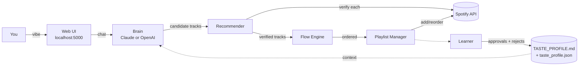
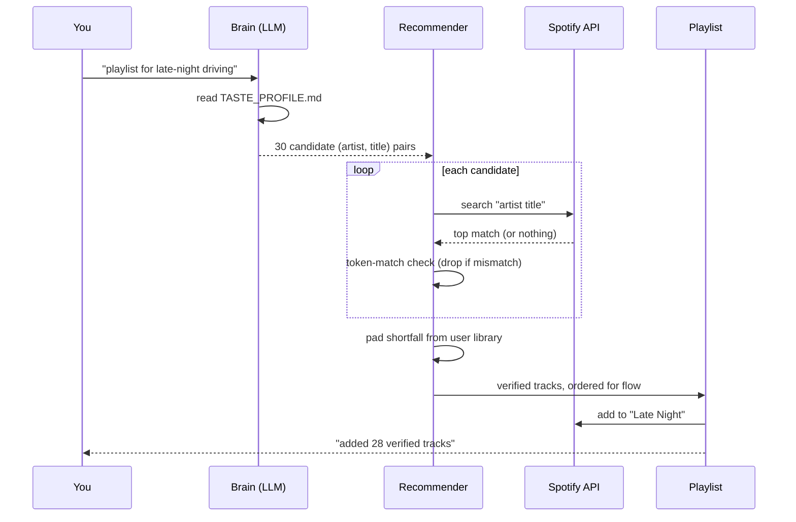
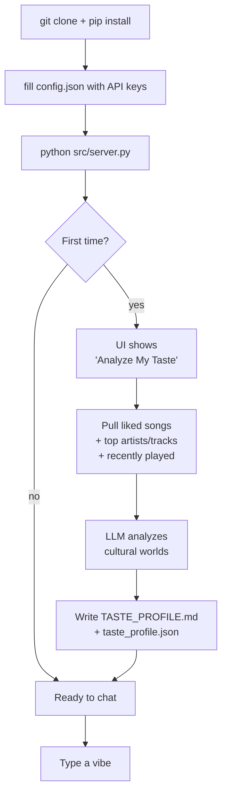
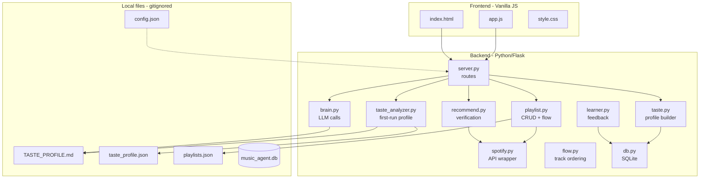

# Architecture

How Vibe Music Agent turns a sentence into a playlist.

## System overview

A vibe enters as plain text in the Web UI. The Brain reads your taste profile as context and proposes concrete `(artist, title)` candidates. The Recommender verifies each candidate against the live Spotify API, the Flow Engine orders the survivors for emotional shape, and the Playlist Manager writes them to your Spotify account. Every accept and reject loops back through the Learner to refine the profile.

## Track verification — the zero-hallucination guarantee

Every track is re-searched on Spotify; mismatches are silently dropped. The "pad from library" step handles culturally-specific cases where Spotify search returns nothing.

LLMs hallucinate songs constantly — they invent plausible-sounding titles by artists who never recorded them, or attribute real songs to the wrong artist. A naive "ask GPT for tracks, paste IDs into Spotify" pipeline will quietly fail or, worse, add wrong tracks. This pipeline assumes every candidate is suspect: it re-issues a Spotify search for each `(artist, title)` pair the LLM produced and only keeps results whose top match has tokens overlapping both the proposed artist and proposed title. Anything that doesn't survive that check is dropped without comment, and the recommender pads the shortfall from your own library so the playlist still hits the requested length.

## First-launch personalization

The taste profile is generated locally from your Spotify history on first launch. Both files are gitignored — they describe your library, not someone else's.

## Component map

Each box is a Python module or file. Arrows are import or read/write relationships. The "Local files" subgraph is what the user owns — none of it is committed.

| Module | Responsibility |
|---|---|
| [`src/server.py`](../src/server.py) | Flask routes, OAuth, request dispatch |
| [`src/brain.py`](../src/brain.py) | LLM calls (Claude or OpenAI), prompt assembly |
| [`src/recommend.py`](../src/recommend.py) | Candidate verification, token-match, library padding |
| [`src/spotify.py`](../src/spotify.py) | Thin wrapper over Spotipy with retries |
| [`src/playlist.py`](../src/playlist.py) | Playlist CRUD, dedupe, reorder |
| [`src/flow.py`](../src/flow.py) | Energy/tempo/valence ordering arcs |
| [`src/learner.py`](../src/learner.py) | Feedback persistence, profile evolution |
| [`src/taste.py`](../src/taste.py) | Profile builder used at runtime |
| [`src/taste_analyzer.py`](../src/taste_analyzer.py) | First-run library analysis |
| [`src/db.py`](../src/db.py) | SQLite schema and access |

## Why it's structured this way

1. **Verify, don't trust.** LLMs hallucinate. Every recommendation is checked against the live Spotify API before it leaves the recommender. The token-match step is intentionally strict — false negatives are cheap (the library pad covers them), false positives would pollute your playlists forever.
2. **Personalize through context, not fine-tuning.** The taste profile is just two files the LLM reads. Edit them and the agent changes behavior immediately. No retraining, no embeddings to rebuild, no model state to migrate.
3. **Local by default.** No server-side state. No tracking. Your taste, feedback, and credentials never leave your machine except as Spotify/LLM API calls. Wipe the project directory and the agent forgets you completely.
